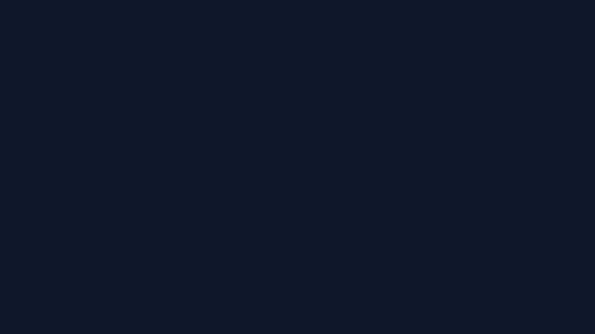

# ConfigForge

<p align="center">
  
</p>

<p align="center">
  <strong>Layered, schema-aware configuration with encrypted secrets for 12-factor apps.</strong>
</p>

<p align="center">
  <a href="https://github.com/ZachDreamZ/configforge/actions/workflows/ci.yml"></a>
  <a href="https://github.com/ZachDreamZ/configforge/blob/master/LICENSE"></a>
  <a href="https://www.python.org/downloads/"></a>
  <a href="https://github.com/ZachDreamZ/configforge/releases"></a>
  
  
</p>

ConfigForge merges configuration from **multiple layered sources** — default
files, environment-specific overlays, environment variables, and encrypted
secrets — into a single resolved config, **validates** it against a schema, and
exposes it as a clean Python object or JSON.

Dependency-free for the core path (merge + validate + env). The optional
encrypted-secrets feature uses [`cryptography`](https://pypi.org/project/cryptography)
under a Fernet envelope.

---

## Table of Contents

- [Quick start](#quick-start)
- [Why ConfigForge?](#why-configforge)
- [Features](#features)
- [Install](#install)
- [Architecture](#architecture)
- [CLI reference](#cli-reference)
- [Python API](#python-api)
- [Schema reference](#schema-reference)
- [Examples](#examples)
  - [Static config merge](#static-config-merge)
  - [Live free-API integration](#live-free-api-integration)
  - [Encrypted secrets demo](#encrypted-secrets-demo)
- [Development](#development)
- [Roadmap](#roadmap)
- [License](#license)

---

## Quick start

```python
from configforge import forge, Layer

base = Layer.from_dict({"app": "demo", "server": {"host": "0.0.0.0", "port": 8080}})
override = Layer.from_dict({"server": {"port": 9090}})

config = forge(base, override)
print(config["server"]["port"])  # 9090 (later layer wins, nested merge)
```

No dependencies. One import. Two layers merged.

### Live Demo

<p align="center">
  
</p>

---

## Why ConfigForge?

Most config libraries either (a) just read one file, or (b) silently let later
values clobber earlier ones. ConfigForge does three things most don't, in one
small package:

- **Strict conflict detection** — a scalar set differently by two layers is a
  hard error by default, so "who wins?" bugs surface at startup, not in prod.
- **Schema validation at resolve time** — types, required fields, ranges, and
  patterns are checked when config is built, with helpful messages.
- **Encrypted secrets as a first-class layer** — decrypt a Fernet token and
  merge it like any other layer, no separate codepath.

---

## Features

- **Layered merge** — any number of `Layer` sources; later wins on nested dicts.
- **Conflict safety** — scalar collisions raise `MergeConflictError` (disable
  with `--no-fail-on-conflict` for intentional overrides).
- **Schema validation** — `type`, `required`, `default`, `min`/`max`,
  `pattern`, and `additional: false` (reject unknown keys).
- **Env folding** — `APP__DB__HOST` becomes `{"DB": {"HOST": ...}}`.
- **Encrypted secrets** — Fernet envelope via the `secrets` extra; decrypt and
  merge like any other layer.
- **Zero core dependencies**, Python 3.9+, works on Windows / Linux / macOS.
- **Fully tested** — 22 unit + integration tests, CI on 3 OS × 4 Python versions.

---

## Install

> ConfigForge is not yet on PyPI. Install from source (works today):

```bash
git clone https://github.com/ZachDreamZ/configforge.git
cd configforge
pip install -e ".[secrets]"        # core (zero deps)
pip install -e ".[dev,secrets]"    # + test deps
```

---

## Architecture

<p align="center">
  
</p>

The merge is pure and deterministic; validation mutates nothing but fills in
declared defaults. Secrets are decrypted to a plain dict before merge, so they
are indistinguishable from any other layer.

---

## CLI reference

```bash
# Merge two JSON layers, fold in APP__* env vars, validate against a schema
configforge \
  -l base.json -l override.json \
  --env-prefix APP__ \
  --schema schema.json

# Decrypt a Fernet secrets token and merge it in
export CONFIGFORGE_KEY="<32-byte base64 key>"
configforge -l base.json --secrets secrets.token

# Generate a fresh key
configforge --generate-key
```

A conflicting scalar (`{"port":1}` vs `{"port":2}`) exits non-zero:

```
configforge: error: conflicting value for 'port': 1 vs 2
```

---

## Python API

```python
from configforge import forge, Layer, load_schema, decrypt_secrets

layers = [Layer.from_json_file("base.json"), Layer.from_json_file("override.json")]
schema = load_schema("schema.json")
secrets = decrypt_secrets("secrets.token", key=KEY)

config = forge(*layers, schema=schema, secrets=secrets, env_prefix="APP__")

config.get("server.port")        # via the underlying dict
config["server"]["host"]
"debug" in config
config.to_json()                  # pretty JSON string
```

---

## Schema reference

```json
{
  "fields": {
    "port":  { "type": "int",  "required": true, "min": 1, "max": 65535 },
    "host":  { "type": "str",  "default": "localhost", "pattern": "^[a-z0-9.-]+$" },
    "debug": { "type": "bool" }
  },
  "additional": false
}
```

| Key          | Meaning                                                  |
| ------------ | -------------------------------------------------------- |
| `type`       | `str` `int` `float` `bool` `list` `dict` `any`           |
| `required`   | error if missing and no `default`                        |
| `default`    | value used when the field is absent                      |
| `min`/`max`  | numeric bounds (int/float)                               |
| `pattern`    | regex the string must match                              |
| `additional` | `false` rejects keys not declared in `fields`            |

---

## Examples

### Static config merge

```python
from configforge import forge, Layer

base = Layer.from_dict({
    "app": "demo",
    "server": {"host": "0.0.0.0", "port": 8080, "workers": 4}
})
override = Layer.from_dict({
    "server": {"port": 9090, "workers": 8}
})

config = forge(base, override)
print(config.to_json())
# {
#   "app": "demo",
#   "server": {
#     "host": "0.0.0.0",
#     "port": 9090,
#     "workers": 8
#   }
# }
```

### Live free-API integration

ConfigForge can resolve config that includes data fetched from a live API at
runtime. Here, a static base config merges with a random dog image URL from
[dog.ceo](https://dog.ceo) — a free, no-auth public API (one of 22 audited and
confirmed live):

```python
import json, urllib.request
from configforge import forge, Layer

base = Layer.from_dict({
    "app": "pet-wall",
    "features": {"random_image": True},
    "limits": {"max_requests": 100}
})

resp = urllib.request.urlopen(
    urllib.request.Request(
        "https://dog.ceo/api/breeds/image/random",
        headers={"User-Agent": "configforge-example/1.0"}
    )
)
live = json.loads(resp.read().decode("utf-8"))
live_layer = Layer.from_dict(
    {"runtime": {"image_url": live["message"], "status": live["status"]}},
    name="live:dog.ceo"
)

schema = {"fields": {"app": {"type": "str", "required": True},
                     "features": {"type": "dict"},
                     "limits": {"type": "dict"},
                     "runtime": {"type": "dict", "required": True}}}

config = forge(base, live_layer, schema=schema)
print(config.to_json())
```

Output (actual, from a live run):

```json
{
  "app": "pet-wall",
  "features": { "random_image": true },
  "limits": { "max_requests": 100 },
  "runtime": {
    "image_url": "https://images.dog.ceo/breeds/hound-ibizan/n02091244_4914.jpg",
    "status": "success"
  }
}
```

See the full runnable example at
[`examples/live_config_example.py`](examples/live_config_example.py).

### Encrypted secrets demo

```python
from configforge import forge, Layer, decrypt_secrets, generate_key

key = generate_key()  # or set CONFIGFORGE_KEY in env

base = Layer.from_dict({"app": "demo", "host": "localhost"})
secrets = decrypt_secrets("secrets.token", key=key)

config = forge(base, secrets)
print(config["db_password"])  # decrypted and merged
```

For a complete end-to-end fixture that exercises merge, validate, env vars,
secrets round-trip, conflict detection, and key generation, see
[`examples/make_demo.py`](examples/make_demo.py).

---

## Development

```bash
pip install -e ".[dev,secrets]"
pytest
```

---

## Roadmap

- YAML / TOML layer loaders (via optional extras).
- Remote layers (HTTP/S3) behind a pluggable `LayerSource` protocol.
- `configforge diff` to visualize what each layer contributed.

---

## License

[MIT](LICENSE) © ZachDreamZ
