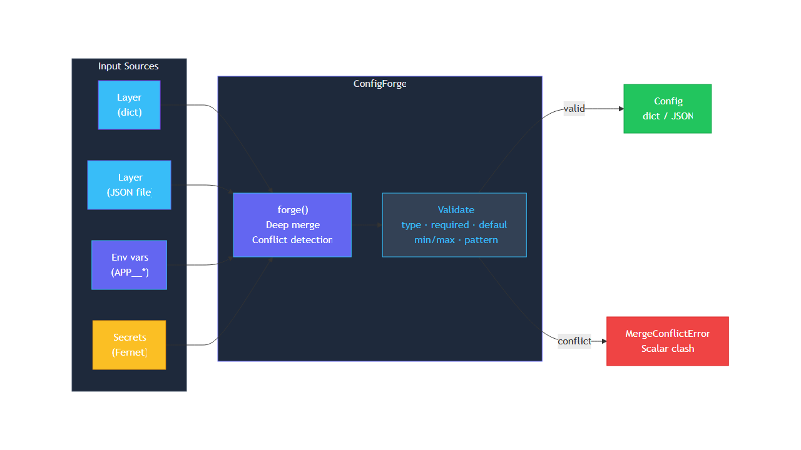

# ConfigForge

<p align="center">
  
</p>

<p align="center">
  <strong>Layered application configuration with schema validation and encrypted secrets.</strong><br>
  Merge, validate, secure — zero core dependencies.
</p>

<p align="center">
  <a href="https://github.com/ZachDreamZ/configforge/actions/workflows/ci.yml"></a>
  <a href="https://github.com/ZachDreamZ/configforge/blob/master/LICENSE"></a>
  
  
  
</p>

---

```
❯ configforge — layered application configuration

  Merges config from multiple sources — JSON files, environment
  variables, default values, and encrypted secrets — into a single
  validated dictionary. Nested dicts merge deeply. Scalar conflicts
  raise hard errors. Schemas enforce types at resolve time.

  ✓ zero core dependencies
  ✓ encrypted secrets (Fernet envelope)
  ✓ Python 3.9+ · Windows / Linux / macOS
```

```python
from configforge import forge, Layer

config = forge(
    Layer.from_dict({"app": "my-app", "server": {"port": 8080}}),
    Layer.from_dict({"server": {"host": "0.0.0.0"}}),
)
config["server"]["port"]  # 8080 — nested merge preserves siblings
```

---

## What it does

- **Layered merge** — combine any number of sources; later layers win on nested dicts
- **Conflict safety** — a scalar set to different values by two layers raises `MergeConflictError`
- **Schema validation** — `type`, `required`, `default`, `min`/`max`, `pattern`, `additional: false`
- **Environment variable folding** — `APP__DB__HOST` auto-expands to `{"DB": {"HOST": ...}}`
- **Encrypted secrets** — Fernet-encrypted tokens decrypted and merged like any other layer
- **Pure Python** — zero dependencies for core path, `cryptography` optional for secrets

## Preview

<p align="center">
  
</p>

Live API config resolution: a static base config merges with a random-dog-image response from the free [dog.ceo](https://dog.ceo) API at runtime. Full runnable example at [`examples/live_config_example.py`](examples/live_config_example.py).

---

## Install

```bash
pip install -e ".[secrets]"     # core + encrypted secrets support
pip install -e ".[dev,secrets]" # + test/development dependencies
```

ConfigForge is not yet on PyPI. Install from source (works today).

---

## Architecture

<p align="center">
  
</p>

Sources feed into `forge()` which performs a deep merge, validates the result against an optional schema, and returns a `Config` object. Scalar conflicts short-circuit with `MergeConflictError` before validation runs.

---

## CLI

```bash
configforge \
  -l base.json -l override.json \
  --env-prefix APP__ \
  --schema schema.json

# Encrypted secrets
export CONFIGFORGE_KEY="<32-byte base64 key>"
configforge -l base.json --secrets secrets.token

# Generate a Fernet key
configforge --generate-key
```

A conflicting scalar exits non-zero with a clear message:

```
configforge: error: conflicting value for 'port': 1 vs 2
```

---

## Python API

```python
from configforge import forge, Layer, load_schema, decrypt_secrets, generate_key

# Build layers
layers = [
    Layer.from_json_file("defaults.json"),
    Layer.from_json_file("production.json"),
]
schema = load_schema("schema.json")

# Decrypt secrets (requires CONFIGFORGE_KEY or explicit key)
secrets = decrypt_secrets("secrets.token")

# Merge and validate
config = forge(*layers, schema=schema, secrets=secrets, env_prefix="APP__")

# Use it
config["server"]["host"]
config.get("server.port")
"debug" in config
config.to_json()  # pretty-printed JSON string
```

### Schema format

```json
{
  "fields": {
    "port":  { "type": "int",  "required": true, "min": 1, "max": 65535 },
    "host":  { "type": "str",  "default": "localhost", "pattern": "^[a-z0-9.-]+$" },
    "debug": { "type": "bool" },
    "allowed_origins": { "type": "list" }
  },
  "additional": false
}
```

| Key          | Meaning                                                  |
| ------------ | -------------------------------------------------------- |
| `type`       | `str` `int` `float` `bool` `list` `dict` `any`           |
| `required`   | error if missing and no `default`                        |
| `default`    | value used when field is absent                          |
| `min`/`max`  | numeric bounds (int/float)                               |
| `pattern`    | regex the string must match                              |
| `additional` | `false` rejects keys not declared in `fields`            |

---

## Examples

### Static merge

```python
from configforge import forge, Layer

base = Layer.from_dict({
    "app": "demo",
    "server": {"host": "0.0.0.0", "port": 8080, "workers": 4},
})
override = Layer.from_dict({"server": {"port": 9090, "workers": 8}})

config = forge(base, override)
print(config.to_json())
# {
#   "app": "demo",
#   "server": {
#     "host": "0.0.0.0",
#     "port": 9090,
#     "workers": 8
#   }
# }
```

### Live API integration

ConfigForge can incorporate live API responses into a resolved config at runtime:

```python
import json, urllib.request
from configforge import forge, Layer

base = Layer.from_dict({
    "app": "pet-wall",
    "features": {"random_image": True},
    "limits": {"max_requests": 100},
})

resp = urllib.request.urlopen(urllib.request.Request(
    "https://dog.ceo/api/breeds/image/random",
    headers={"User-Agent": "configforge-example/1.0"},
))
live = json.loads(resp.read())
live_layer = Layer.from_dict(
    {"runtime": {"image_url": live["message"], "status": live["status"]}},
    name="live:dog.ceo",
)

schema = {
    "fields": {
        "app": {"type": "str", "required": True},
        "features": {"type": "dict"},
        "limits": {"type": "dict"},
        "runtime": {"type": "dict", "required": True},
    }
}

config = forge(base, live_layer, schema=schema)
print(config.to_json())
```

Output:

```json
{
  "app": "pet-wall",
  "features": { "random_image": true },
  "limits": { "max_requests": 100 },
  "runtime": {
    "image_url": "https://images.dog.ceo/breeds/hound-ibizan/n02091244_4914.jpg",
    "status": "success"
  }
}
```

See [`examples/live_config_example.py`](examples/live_config_example.py) for the full runnable script.

### Encrypted secrets

```python
from configforge import forge, Layer, decrypt_secrets, generate_key

key = generate_key()  # or set CONFIGFORGE_KEY env var

config = forge(
    Layer.from_dict({"app": "demo", "host": "localhost"}),
    decrypt_secrets("secrets.token", key=key),
)
print(config["db_password"])  # decrypted and merged
```

---

## Development

```bash
pip install -e ".[dev,secrets]"
pytest          # runs all 22 tests
pytest -v       # verbose
```

---

## Roadmap

- YAML/TOML layer loaders (optional extras)
- Remote layers (HTTP, S3) behind a pluggable `LayerSource` protocol
- `configforge diff` — visualize each layer's contribution

---

## License

[MIT](LICENSE) &copy; ZachDreamZ
